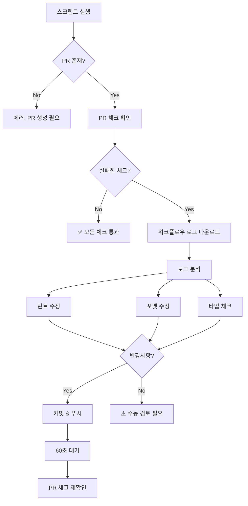
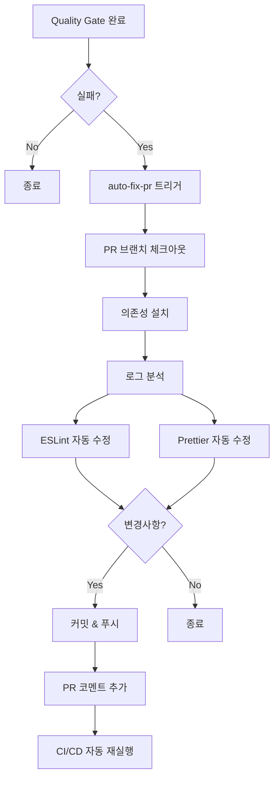

# PR 체크 자동화 및 자동 수정 워크플로우

이 워크플로우는 CI/CD 파이프라인 완료 후 PR 상태를 자동으로 확인하고, 실패한 경우 로그를 분석하여 자동으로 수정합니다.

## 구현된 파일

1. **자동화 스크립트**: [`scripts/auto-fix-pr.sh`](file:///Users/sooyeon/Developer/tekton/scripts/auto-fix-pr.sh)
   - 로컬에서 수동으로 실행할 수 있는 bash 스크립트
   - PR 체크 상태 확인, 로그 분석, 자동 수정 수행

2. **GitHub Actions 워크플로우**: [`.github/workflows/auto-fix-pr.yml`](file:///Users/sooyeon/Developer/tekton/.github/workflows/auto-fix-pr.yml)
   - Quality Gate 실패 시 자동으로 실행
   - 린트 및 포맷팅 오류 자동 수정
   - PR에 자동으로 코멘트 추가

## 사용 방법

### 방법 1: 로컬에서 수동 실행

PR을 생성한 후, CI/CD가 실패하면 다음 명령어를 실행하세요:

// turbo

```bash
./scripts/auto-fix-pr.sh
```

스크립트가 자동으로:

1. PR 체크 상태 확인
2. 실패한 워크플로우 로그 다운로드
3. 로그 분석 (린트, 포맷, 타입 체크, 테스트, 빌드 오류)
4. 자동 수정 가능한 항목 수정 (ESLint, Prettier)
5. 변경사항 커밋 및 푸시
6. CI/CD 재실행 대기 및 결과 확인

### 방법 2: GitHub Actions 자동 실행

GitHub Actions 워크플로우가 이미 설정되어 있으므로, **아무 작업도 필요 없습니다**!

Quality Gate가 실패하면 자동으로:

1. `auto-fix-pr.yml` 워크플로우가 트리거됨
2. 린트 및 포맷팅 자동 수정
3. 수정사항 커밋 및 푸시
4. PR에 자동 수정 내용 코멘트 추가
5. CI/CD 자동 재실행

## 자동 수정 가능한 오류 유형

✅ **자동 수정 가능**:

- ESLint 린트 오류 (`--fix` 옵션으로 수정 가능한 것)
- Prettier 포맷팅 오류
- 간단한 코드 스타일 문제

⚠️ **수동 검토 필요**:

- TypeScript 타입 오류
- 테스트 실패
- 빌드 오류
- 로직 오류

## 워크플로우 동작 방식

### 로컬 스크립트 (`auto-fix-pr.sh`)



### GitHub Actions 워크플로우



## 예시 시나리오

### 시나리오 1: 린트 오류 자동 수정

1. PR 생성 후 Quality Gate 실패
2. GitHub Actions가 자동으로 `auto-fix-pr` 실행
3. ESLint 오류 자동 수정
4. 커밋 메시지: `chore: auto-fix CI/CD failures`
5. PR에 코멘트 추가: "🤖 Auto-fix Applied"
6. CI/CD 자동 재실행 → ✅ 통과

### 시나리오 2: 복잡한 오류 (수동 개입 필요)

1. PR 생성 후 Quality Gate 실패 (타입 오류)
2. 로컬에서 `./scripts/auto-fix-pr.sh` 실행
3. 스크립트가 타입 오류 감지
4. 로그 출력: "Type errors found. These require manual review"
5. 개발자가 타입 오류 수동 수정
6. 수정 후 푸시 → CI/CD 재실행

## 사전 요구사항

### GitHub CLI 설치 및 인증

```bash
# GitHub CLI 설치 (macOS)
brew install gh

# 인증
gh auth login
```

### 권한 설정

GitHub Actions 워크플로우가 작동하려면 다음 권한이 필요합니다:

- `contents: write` - 코드 커밋 및 푸시
- `pull-requests: write` - PR 코멘트 추가
- `actions: read` - 워크플로우 로그 읽기

이 권한은 이미 `.github/workflows/auto-fix-pr.yml`에 설정되어 있습니다.

## 주의사항

⚠️ **중요**:

- 자동 수정은 **간단한 린트/포맷 오류**에만 적용됩니다
- **복잡한 로직 오류**나 **테스트 실패**는 수동으로 검토해야 합니다
- 무한 루프 방지를 위해 GitHub Actions는 **PR 브랜치에서만** 실행됩니다 (main/master 제외)
- 자동 수정 후에도 실패하면 **수동 개입이 필요**합니다

## 트러블슈팅

### 스크립트 실행 권한 오류

```bash
chmod +x scripts/auto-fix-pr.sh
```

### GitHub CLI 인증 오류

```bash
gh auth status
gh auth login
```

### 워크플로우가 트리거되지 않음

1. `.github/workflows/auto-fix-pr.yml` 파일이 main 브랜치에 머지되었는지 확인
2. Quality Gate 워크플로우 이름이 정확한지 확인 (`workflows: ["Quality Gate"]`)
3. GitHub Actions 권한 설정 확인

## 추가 개선 사항

향후 다음 기능을 추가할 수 있습니다:

- [ ] Claude를 활용한 지능형 오류 분석 및 수정
- [ ] 테스트 실패 자동 수정 (스냅샷 업데이트 등)
- [ ] 자동 수정 시도 횟수 제한 (무한 루프 방지)
- [ ] Slack/Discord 알림 통합
- [ ] 자동 수정 성공률 통계
