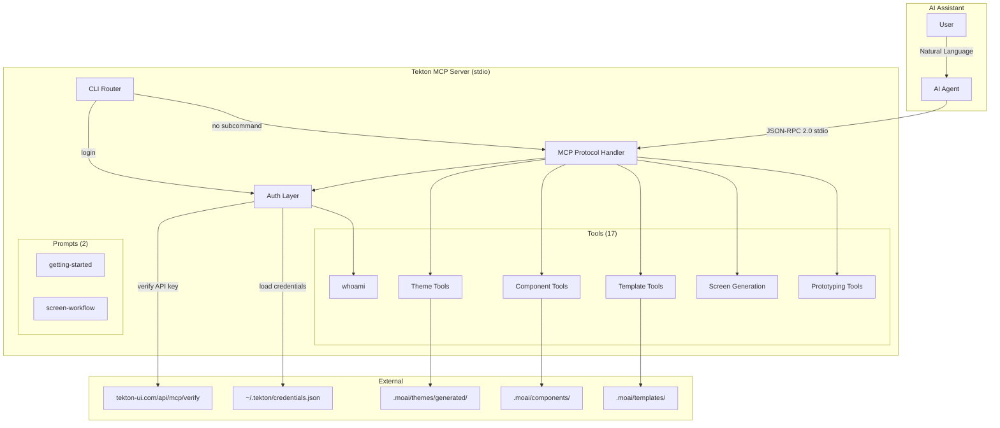
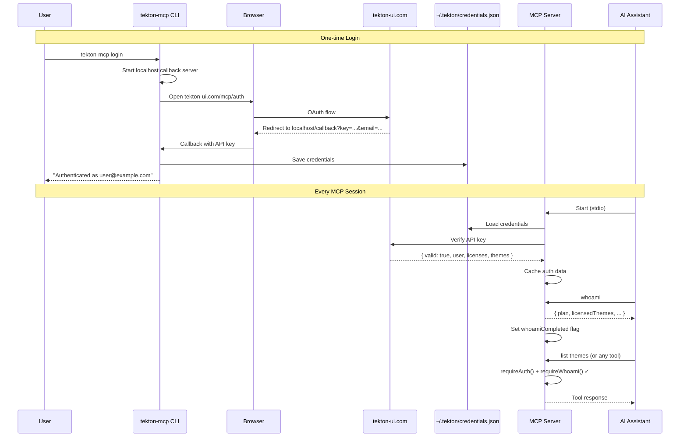
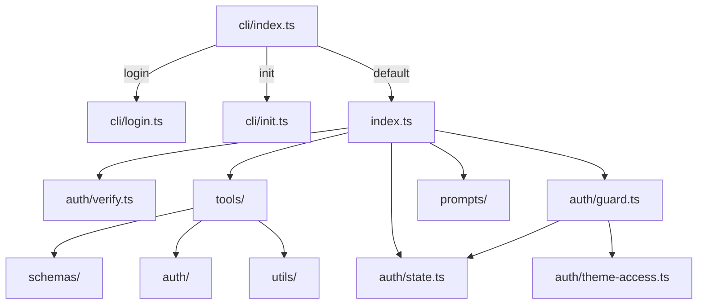
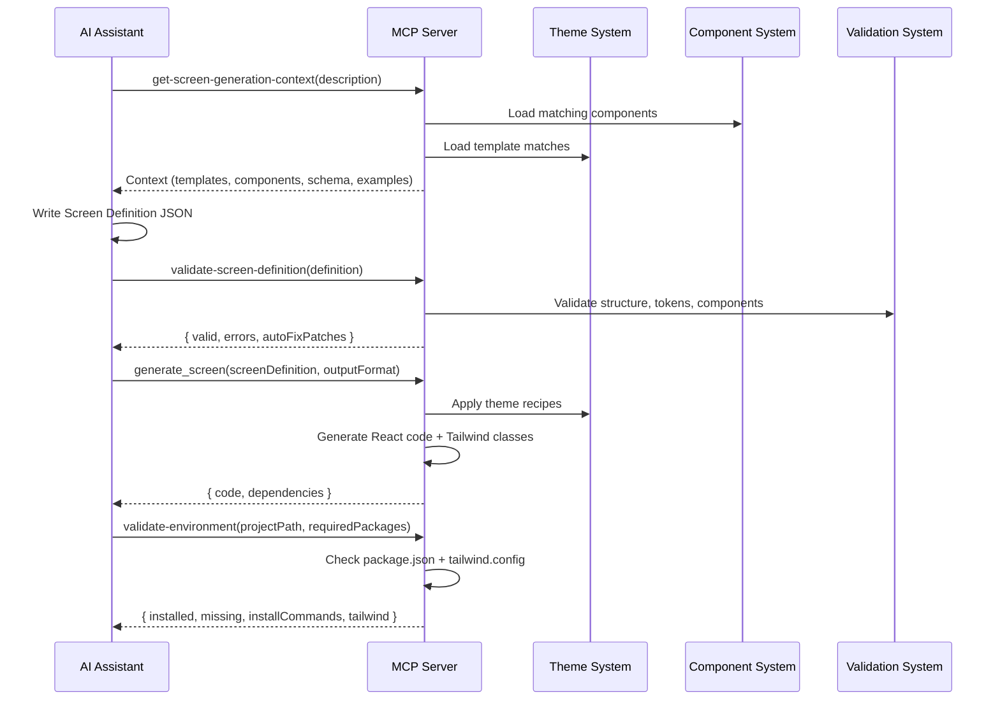

# Architecture Documentation

System architecture and data flow for Tekton MCP Server v0.4.5.

## Table of Contents

1. [System Overview](#system-overview)
2. [Architecture Diagram](#architecture-diagram)
3. [Module Structure](#module-structure)
4. [Authentication Layer](#authentication-layer)
5. [Data Flow](#data-flow)
6. [Security](#security)

---

## System Overview

### Core Concepts

Tekton MCP Server is a **stdio-based MCP protocol** server that communicates with AI coding assistants via JSON-RPC 2.0.

**Key Components**:

- **CLI Router**: Command routing for `login`, `logout`, `status`, `init`, and MCP server start
- **Auth Layer**: OAuth login, API key verification, license gating, whoami enforcement
- **MCP Protocol Handler**: stdio-based JSON-RPC 2.0 tool/prompt registration
- **17 MCP Tools**: Theme, component, template, and screen generation tools
- **2 MCP Prompts**: Getting started and screen workflow guidance

### Design Principles

1. **stdio-only**: No HTTP server — all communication via stdin/stdout (MCP standard)
2. **Data-only output**: No file writes — AI assistant handles file operations
3. **Auth-gated**: All tools require authentication and `whoami` call
4. **Type safety**: Zod schemas for all input validation
5. **Theme engine**: Theme recipes applied server-side for consistent styling

---

## Architecture Diagram

### System Architecture



### Authentication Flow



---

## Module Structure

### Directory Structure

```
packages/mcp-server/
├── src/
│   ├── index.ts              # MCP server entry point (stdio)
│   │   - Tool/Prompt registration
│   │   - CallTool handler with auth guards
│   │
│   ├── cli/                  # CLI command router
│   │   ├── index.ts          # Subcommand router (login/logout/status/init/default→MCP)
│   │   ├── login.ts          # Browser OAuth flow
│   │   ├── logout.ts         # Clear saved credentials
│   │   ├── status.ts         # Show auth status
│   │   ├── init.ts           # One-line project setup
│   │   ├── credentials.ts    # ~/.tekton/credentials.json management
│   │   ├── guide-template.ts # TEKTON-GUIDE.md generator
│   │   └── agent-md-templates.ts  # CLAUDE.md/AGENTS.md templates
│   │
│   ├── auth/                 # Authentication layer
│   │   ├── verify.ts         # API key verification (tekton-ui.com)
│   │   ├── guard.ts          # requireAuth() + requireWhoami() guards
│   │   ├── state.ts          # Auth data & whoamiCompleted state
│   │   ├── cache.ts          # Verification cache (5-min TTL)
│   │   └── theme-access.ts   # Theme license check + master accounts
│   │
│   ├── tools/                # 17 MCP Tool implementations
│   │   ├── whoami.ts
│   │   ├── generate-blueprint.ts
│   │   ├── preview-theme.ts
│   │   ├── list-themes.ts
│   │   ├── export-screen.ts
│   │   ├── generate-screen.ts
│   │   ├── validate-screen.ts
│   │   ├── list-tokens.ts
│   │   ├── list-icon-libraries.ts
│   │   ├── preview-icon-library.ts
│   │   ├── list-components.ts
│   │   ├── preview-component.ts
│   │   ├── list-screen-templates.ts
│   │   ├── preview-screen-template.ts
│   │   ├── get-screen-generation-context.ts
│   │   ├── validate-screen-definition.ts
│   │   └── validate-environment.ts
│   │
│   ├── prompts/              # MCP Prompt implementations
│   │   ├── getting-started.ts
│   │   └── screen-workflow.ts
│   │
│   ├── schemas/              # Zod validation schemas
│   │   └── mcp-schemas.ts
│   │
│   └── utils/                # Utilities
│       ├── logger.ts
│       └── error-handler.ts
│
├── __tests__/                # Test suite
├── docs/                     # Documentation (this directory)
├── dist/                     # Build output
└── package.json
```

### Module Dependencies



---

## Authentication Layer

### Components

| Module                 | Responsibility                                                         |
| ---------------------- | ---------------------------------------------------------------------- |
| `cli/login.ts`         | Browser OAuth flow: localhost callback server → save credentials       |
| `cli/credentials.ts`   | Read/write `~/.tekton/credentials.json`                                |
| `auth/verify.ts`       | `verifyApiKey()`: GET `tekton-ui.com/api/mcp/verify` with Bearer token |
| `auth/guard.ts`        | `requireAuth()` and `requireWhoami()` — throws if not met              |
| `auth/state.ts`        | In-memory auth state: `authData`, `whoamiCompleted` flag               |
| `auth/cache.ts`        | API key verification cache (5-minute TTL)                              |
| `auth/theme-access.ts` | `PREMIUM_THEMES` list, `MASTER_EMAILS`, `isMasterAccount()`            |

### Auth Guard Flow

Every tool call in `CallToolRequestSchema` handler:

```
1. requireAuth()     → Throws AuthRequiredError if no valid credentials
2. requireWhoami()   → Throws WhoamiRequiredError if whoami not called yet
   (skipped for whoami tool itself)
3. Execute tool
```

### Master Accounts

Master accounts (defined in `auth/theme-access.ts`) have:

- Access to all 6 premium themes
- No license expiry
- `plan: 'master'` in whoami response

---

## Data Flow

### Production Workflow Data Flow



---

## Security

### Input Validation

All MCP tool inputs are validated with **Zod schemas** before processing:

- Theme IDs: `^[a-z0-9-]+$` pattern
- Descriptions: Length bounds (min/max)
- Component IDs: Lowercase with hyphens only
- Template IDs: `^[a-z]+\.[a-z-]+$` format

### Authentication Security

- **CSRF protection**: Random state parameter in OAuth flow
- **Local-only callback**: OAuth callback runs on `127.0.0.1` (not `0.0.0.0`)
- **5-minute timeout**: Login flow times out after 5 minutes
- **No API key in logs**: API keys are never logged

### Theme Access Control

- All 6 themes require a valid license
- Theme access checked on every theme-related operation
- Master accounts bypass license checks

---

**Next**: [Developer Guide](./05-developer-guide.md) — Contributing & testing

**Version**: 0.4.5 | **Last Updated**: 2026-02-16
