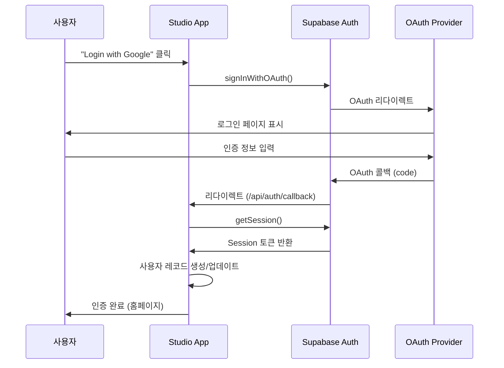
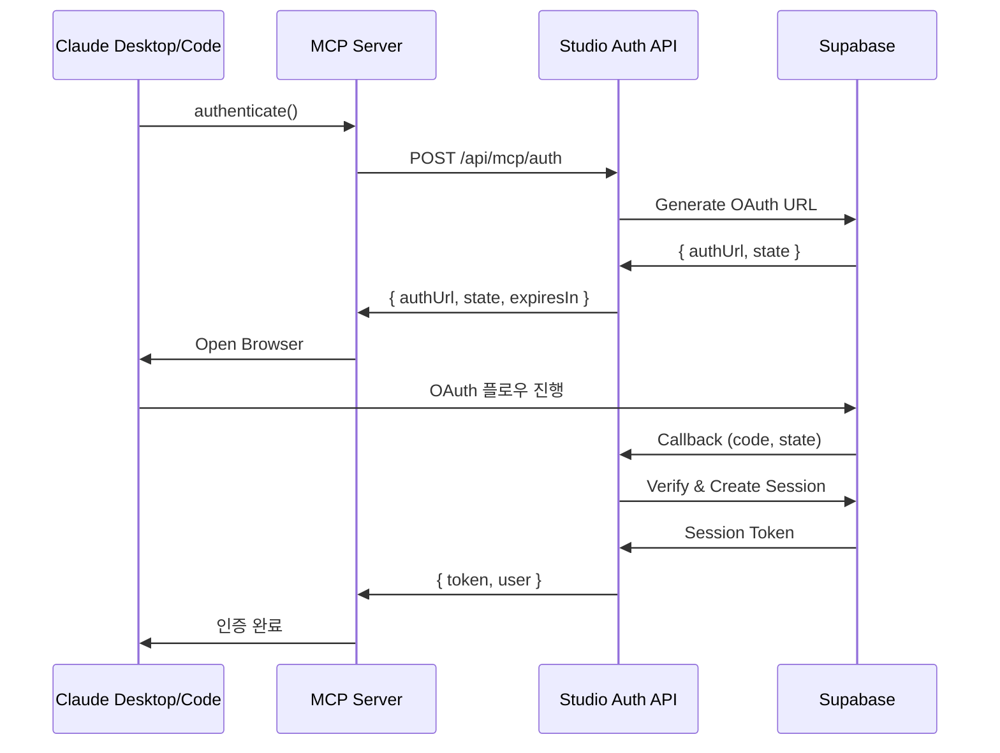

# Supabase Authentication 통합 가이드

## 개요

Tekton Studio는 **Supabase Authentication**을 사용하여 안전하고 확장 가능한 사용자 인증 시스템을 제공합니다. OAuth 2.0 기반 소셜 로그인, 세션 관리, 사용자 데이터 저장을 지원합니다.

### 주요 기능

- **OAuth 소셜 로그인**: Google, GitHub 인증
- **자동 세션 관리**: 페이지 새로고침 시에도 세션 유지
- **MCP 인증**: Claude Desktop/Code 통합
- **라이선스 관리**: 템플릿 접근 권한 제어
- **RLS(Row Level Security)**: 데이터베이스 수준 보안

---

## 아키텍처

### 시스템 구조

```
┌─────────────┐      ┌──────────────┐      ┌─────────────┐
│   Browser   │ ───> │  Next.js App │ ───> │  Supabase   │
│             │      │              │      │   Auth      │
│ AuthContext │ <─── │  Middleware  │ <─── │   Server    │
└─────────────┘      └──────────────┘      └─────────────┘
                            │
                            ▼
                     ┌──────────────┐
                     │  PostgreSQL  │
                     │   Database   │
                     └──────────────┘
```

### 컴포넌트 구조

```
lib/
├── supabase/
│   ├── client.ts           # 브라우저 클라이언트
│   ├── server.ts           # 서버 클라이언트
│   └── middleware.ts       # 세션 갱신 헬퍼
├── auth/
│   └── supabase-auth.ts    # 인증 헬퍼 함수
└── db/
    ├── users.ts            # 사용자 CRUD
    ├── licenses.ts         # 라이선스 관리
    └── templates.ts        # 템플릿 접근 제어

contexts/
└── AuthContext.tsx         # 전역 인증 상태

app/
├── api/
│   ├── auth/
│   │   └── callback/
│   │       └── route.ts    # OAuth 콜백 핸들러
│   └── mcp/
│       └── auth/
│           └── route.ts    # MCP 인증 API
└── middleware.ts           # 루트 미들웨어
```

---

## OAuth 인증 플로우

### 시퀀스 다이어그램



### 구현 코드

```typescript
// lib/auth/supabase-auth.ts
import { createClient } from '@/lib/supabase/client';

export async function signInWithGoogle() {
  const supabase = createClient();

  const { data, error } = await supabase.auth.signInWithOAuth({
    provider: 'google',
    options: {
      redirectTo: `${window.location.origin}/api/auth/callback`,
    },
  });

  if (error) {
    throw new Error(`Google login failed: ${error.message}`);
  }

  return data;
}

export async function signInWithGitHub() {
  const supabase = createClient();

  const { data, error } = await supabase.auth.signInWithOAuth({
    provider: 'github',
    options: {
      redirectTo: `${window.location.origin}/api/auth/callback`,
    },
  });

  if (error) {
    throw new Error(`GitHub login failed: ${error.message}`);
  }

  return data;
}

export async function signOut() {
  const supabase = createClient();
  const { error } = await supabase.auth.signOut();

  if (error) {
    throw new Error(`Sign out failed: ${error.message}`);
  }
}
```

---

## MCP 인증 플로우

MCP(Model Context Protocol) 서버가 Claude Desktop/Code와 통합하여 사용자 인증을 처리합니다.

### 시퀀스 다이어그램



### MCP 인증 API

```typescript
// app/api/mcp/auth/route.ts
import { NextRequest, NextResponse } from 'next/server';
import { createClient } from '@/lib/supabase/server';

export async function POST(request: NextRequest) {
  try {
    const body = await request.json();
    const { client_id, redirect_uri, state } = body;

    const supabase = createClient();

    // OAuth URL 생성
    const { data, error } = await supabase.auth.signInWithOAuth({
      provider: 'google',
      options: {
        redirectTo: redirect_uri,
        queryParams: {
          state,
          client_id,
        },
      },
    });

    if (error) {
      return NextResponse.json({ error: error.message }, { status: 400 });
    }

    return NextResponse.json({
      auth_url: data.url,
      state,
      expires_in: 600, // 10분
    });
  } catch (error) {
    return NextResponse.json({ error: 'Internal server error' }, { status: 500 });
  }
}
```

---

## API 참조

### GET /api/auth/callback

OAuth 콜백을 처리하고 세션을 생성합니다.

**Query Parameters**:

- `code` (string, required): OAuth authorization code
- `state` (string, optional): CSRF protection state

**Response**:

- 성공 시: 홈페이지로 리다이렉트
- 실패 시: `/auth/error?message=...`로 리다이렉트

**구현**:

```typescript
// app/api/auth/callback/route.ts
import { NextRequest, NextResponse } from 'next/server';
import { createClient } from '@/lib/supabase/server';

export async function GET(request: NextRequest) {
  const searchParams = request.nextUrl.searchParams;
  const code = searchParams.get('code');

  if (!code) {
    return NextResponse.redirect(new URL('/auth/error?message=No code provided', request.url));
  }

  const supabase = createClient();

  // Exchange code for session
  const { error } = await supabase.auth.exchangeCodeForSession(code);

  if (error) {
    return NextResponse.redirect(new URL(`/auth/error?message=${error.message}`, request.url));
  }

  // 성공 - 홈페이지로 리다이렉트
  return NextResponse.redirect(new URL('/', request.url));
}
```

### POST /api/mcp/auth

MCP 클라이언트 인증을 시작합니다.

**Request Body**:

```typescript
{
  client_id: string;
  redirect_uri: string;
  state: string;
}
```

**Response**:

```typescript
{
  auth_url: string; // OAuth 인증 URL
  state: string; // CSRF state
  expires_in: number; // URL 만료 시간 (초)
}
```

**Error Codes**:

- `400`: Invalid request parameters
- `500`: Internal server error

---

## 데이터베이스 스키마

### user_licenses 테이블

사용자의 템플릿 라이선스 정보를 저장합니다.

```sql
CREATE TABLE user_licenses (
  id UUID PRIMARY KEY DEFAULT gen_random_uuid(),
  user_id UUID REFERENCES auth.users(id) ON DELETE CASCADE,
  theme_id VARCHAR(50) NOT NULL,
  tier VARCHAR(20) CHECK (tier IN ('single', 'double', 'creator')),
  paddle_subscription_id VARCHAR(100),
  purchased_at TIMESTAMPTZ DEFAULT NOW(),
  expires_at TIMESTAMPTZ,
  is_active BOOLEAN DEFAULT true,
  UNIQUE(user_id, theme_id)
);

-- 인덱스
CREATE INDEX idx_user_licenses_user_id ON user_licenses(user_id);
CREATE INDEX idx_user_licenses_theme_id ON user_licenses(theme_id);
CREATE INDEX idx_user_licenses_is_active ON user_licenses(is_active);
```

**필드 설명**:

- `user_id`: Supabase Auth 사용자 ID
- `theme_id`: 템플릿 식별자
- `tier`: 라이선스 등급 (single, double, creator)
- `paddle_subscription_id`: Paddle 구독 ID (결제 연동)
- `is_active`: 라이선스 활성 상태

### free_screen_templates 테이블

무료로 제공되는 스크린 템플릿 목록을 관리합니다.

```sql
CREATE TABLE free_screen_templates (
  id UUID PRIMARY KEY DEFAULT gen_random_uuid(),
  template_id VARCHAR(50) NOT NULL UNIQUE,
  name VARCHAR(100) NOT NULL,
  description TEXT,
  is_free BOOLEAN DEFAULT true,
  created_at TIMESTAMPTZ DEFAULT NOW()
);
```

### Row Level Security (RLS) 정책

```sql
-- user_licenses: 사용자는 자신의 라이선스만 조회 가능
ALTER TABLE user_licenses ENABLE ROW LEVEL SECURITY;

CREATE POLICY "Users can view own licenses"
  ON user_licenses FOR SELECT
  USING (auth.uid() = user_id);

CREATE POLICY "Service role can manage all licenses"
  ON user_licenses FOR ALL
  USING (auth.role() = 'service_role');

-- free_screen_templates: 모든 사용자가 조회 가능
ALTER TABLE free_screen_templates ENABLE ROW LEVEL SECURITY;

CREATE POLICY "Anyone can view free templates"
  ON free_screen_templates FOR SELECT
  USING (true);
```

---

## AuthContext 사용 가이드

### Provider 설정

```typescript
// app/layout.tsx
import { AuthProvider } from '@/contexts/AuthContext';

export default function RootLayout({ children }) {
  return (
    <html lang="ko">
      <body>
        <AuthProvider>
          {children}
        </AuthProvider>
      </body>
    </html>
  );
}
```

### 컴포넌트에서 사용

```typescript
// components/LoginButton.tsx
'use client';

import { useAuth } from '@/contexts/AuthContext';

export function LoginButton() {
  const { user, login, logout, isLoading } = useAuth();

  if (isLoading) {
    return <div>Loading...</div>;
  }

  if (user) {
    return (
      <div>
        <p>안녕하세요, {user.email}</p>
        <button onClick={() => logout()}>로그아웃</button>
      </div>
    );
  }

  return (
    <div>
      <button onClick={() => login('google')}>
        Google로 로그인
      </button>
      <button onClick={() => login('github')}>
        GitHub로 로그인
      </button>
    </div>
  );
}
```

### 라이선스 확인

```typescript
'use client';

import { useAuth } from '@/contexts/AuthContext';

export function PremiumFeature({ templateId }: { templateId: string }) {
  const { user, hasLicense } = useAuth();

  if (!user) {
    return <div>로그인이 필요합니다.</div>;
  }

  if (!hasLicense(templateId)) {
    return <div>이 템플릿은 구매가 필요합니다.</div>;
  }

  return <div>프리미엄 기능 사용 가능</div>;
}
```

---

## 테스트 가이드

### 환경 설정

테스트용 `.env.test` 파일 생성:

```env
NEXT_PUBLIC_SUPABASE_URL=http://localhost:54321
NEXT_PUBLIC_SUPABASE_ANON_KEY=test-anon-key
SUPABASE_SERVICE_ROLE_KEY=test-service-role-key
```

### 로컬 Supabase 실행

```bash
# Supabase CLI 설치
npm install -g supabase

# 로컬 Supabase 시작
supabase start

# 마이그레이션 적용
supabase migration up

# 테스트 데이터 시드
supabase seed
```

### 단위 테스트 예시

```typescript
// __tests__/auth/supabase-auth.test.ts
import { describe, it, expect, vi } from 'vitest';
import { signInWithGoogle, signOut } from '@/lib/auth/supabase-auth';

describe('Supabase Auth', () => {
  it('should sign in with Google', async () => {
    const result = await signInWithGoogle();
    expect(result.url).toContain('accounts.google.com');
  });

  it('should sign out', async () => {
    await expect(signOut()).resolves.not.toThrow();
  });
});
```

### 통합 테스트

```typescript
// __tests__/api/auth/callback.test.ts
import { describe, it, expect } from 'vitest';
import { GET } from '@/app/api/auth/callback/route';

describe('OAuth Callback API', () => {
  it('should handle valid OAuth code', async () => {
    const request = new Request('http://localhost:3000/api/auth/callback?code=test-code');
    const response = await GET(request);

    expect(response.status).toBe(302); // Redirect
  });

  it('should reject missing code', async () => {
    const request = new Request('http://localhost:3000/api/auth/callback');
    const response = await GET(request);

    expect(response.status).toBe(302);
    expect(response.headers.get('location')).toContain('error');
  });
});
```

---

## 문제 해결

### 일반적인 문제

#### 1. "Invalid redirect URL" 오류

**원인**: Supabase Dashboard에 리다이렉트 URL이 등록되지 않음

**해결**:

1. Supabase Dashboard → Authentication → URL Configuration
2. Redirect URLs에 다음 추가:
   ```
   http://localhost:3001/api/auth/callback
   https://yourdomain.com/api/auth/callback
   ```

#### 2. "Session not found" 오류

**원인**: 세션 쿠키가 제대로 설정되지 않음

**해결**:

1. HTTPS를 사용하는지 확인 (프로덕션)
2. `SameSite=Lax` 쿠키 설정 확인
3. 브라우저 쿠키 설정 확인

#### 3. OAuth 콜백 무한 루프

**원인**: 잘못된 리다이렉트 설정

**해결**:

```typescript
// middleware.ts에서 콜백 경로 제외
export const config = {
  matcher: ['/((?!api|_next/static|_next/image|favicon.ico|auth/callback).*)'],
};
```

#### 4. "User not found" 데이터베이스 오류

**원인**: RLS 정책이 사용자 데이터 접근을 차단

**해결**:

1. Supabase Dashboard → Database → Policies 확인
2. Service Role Key를 사용하는 서버 측 코드 확인
3. RLS 정책이 올바르게 설정되었는지 확인

### 디버깅 팁

#### 로그 확인

```typescript
// lib/supabase/client.ts에 로깅 추가
export function createClient() {
  return createBrowserClient(
    process.env.NEXT_PUBLIC_SUPABASE_URL!,
    process.env.NEXT_PUBLIC_SUPABASE_ANON_KEY!,
    {
      auth: {
        debug: process.env.NODE_ENV === 'development',
      },
    }
  );
}
```

#### 세션 상태 확인

```typescript
// 컴포넌트에서 세션 디버깅
const { user, session } = useAuth();

console.log('User:', user);
console.log('Session:', session);
console.log('Expires at:', session?.expires_at);
```

#### 네트워크 요청 모니터링

브라우저 DevTools → Network 탭에서 다음 확인:

- `/api/auth/callback` 응답 상태
- Supabase API 요청/응답
- 쿠키 설정 여부

---

## 보안 고려사항

### HTTPS 필수

프로덕션 환경에서는 반드시 HTTPS를 사용하세요.

```typescript
// next.config.ts
const nextConfig = {
  async headers() {
    return [
      {
        source: '/:path*',
        headers: [
          {
            key: 'Strict-Transport-Security',
            value: 'max-age=31536000; includeSubDomains',
          },
        ],
      },
    ];
  },
};
```

### CSRF 보호

OAuth state 매개변수를 사용하여 CSRF 공격을 방지하세요.

```typescript
// MCP 인증에서 state 검증
const { state: returnedState } = searchParams;
if (returnedState !== expectedState) {
  throw new Error('Invalid state parameter');
}
```

### 토큰 갱신

Supabase는 자동으로 토큰을 갱신하지만, 명시적으로 처리할 수도 있습니다.

```typescript
// middleware.ts
export async function middleware(request: NextRequest) {
  const supabase = createServerClient(/* ... */);

  // 세션 갱신
  const {
    data: { session },
  } = await supabase.auth.getSession();

  if (session) {
    await supabase.auth.refreshSession();
  }

  return NextResponse.next();
}
```

---

## 관련 문서

- [SPEC-AUTH-001](/.moai/specs/SPEC-AUTH-001/spec.md) - 전체 SPEC 문서
- [Supabase Auth Documentation](https://supabase.com/docs/guides/auth)
- [Next.js Authentication](https://nextjs.org/docs/authentication)
- [OAuth 2.0 Specification](https://oauth.net/2/)

---

## 지원

문제가 발생하면 다음을 확인하세요:

1. [Troubleshooting 섹션](#문제-해결)
2. [SPEC-AUTH-001 GitHub Issues](https://github.com/your-repo/issues)
3. [Supabase Discord](https://discord.supabase.com/)

---

**문서 버전**: 1.0.0
**최종 업데이트**: 2026-02-04
**작성자**: soo-kate-yeon
